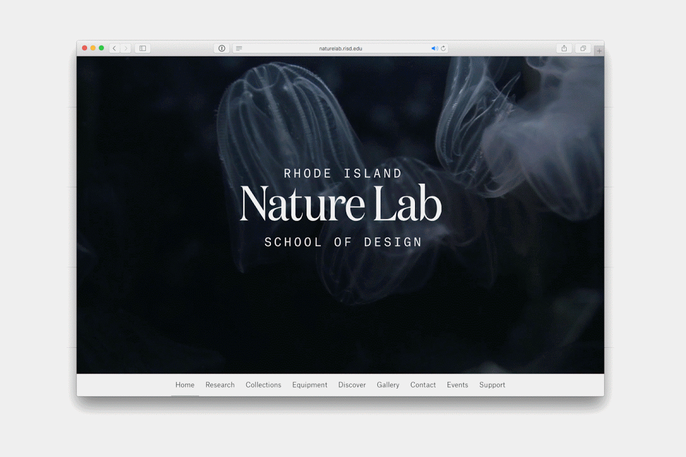

<header class="intro">
	<h1>
		RISD  Media  Group 

		seeks a  director of  design
	</h1>
	
		
		
	
		
	
</header>

<section class="description">
	<h2 class="description__title">Help Wanted</h2>
	

		
RISD Media, the marketing and public relations team at Rhode Island School of Design, creates and executes integrated print and digital communications to engage and inform prospective students, donors and the general public about RISD. The team creates and shares a wide range of stories, news and information about RISD and its people, conveying the value of art and design in our lives.

		
RISD Media is seeking a Director of Design to recommend the vision and direction for RISD’s design capability and lead the team’s design group. Working directly with RISD’s president and senior leaders on highly visible projects of great impact, the director manages the visual representation of the college’s brand both internally and externally.

		
In addition to outstanding design skills and a sophisticated visual sensibility, the ideal candidate will be a visionary and strategic thinker with excellent management, interpersonal, and communications skills.

	

</section>

<section class="description">
	<h2 class="description__title">Recent Work</h2>
	

		<figure class="gallery-image">
			
			

		</figure>
		
		<figure class="gallery-image">
			
			

		</figure>
		
		<figure class="gallery-image">
			
			
		</figure>
		
		<figure class="gallery-image">
			
			
		</figure>
		<figure class="gallery-image">
			
			
		</figure>

		<figure class="gallery-image">
			
			

		</figure>

		<figure class="gallery-image">
			
			

		</figure>
		
		<figure class="gallery-image">
			
			
		</figure>
		
		<figure class="gallery-image">
			
			
		</figure>

		<figure class="gallery-image">
			
			
		</figure>
		
		<figure class="gallery-image">
			
			

		</figure>
		
		<figure class="gallery-image">
			
			

		</figure>

		<figure class="gallery-image">
			
			

		</figure>

		<figure class="gallery-image">
			
			

		</figure>
		
		<figure class="gallery-image">
			
			

		</figure>

		<video class="gallery-video" src="assets/img/commencement/commencement-02.mp4" autoplay loop></video>
		<video class="gallery-video" src="assets/img/nature-lab/nature-lab.mp4"  autoplay loop></video>
	

</section>

<section class="description">
	<h2 class="description__title">Essential Functions / Duties</h2>
	

		<ol>
			<li>Recommend the vision for and manage the caliber and consistency of RISD’s design capability across as all platforms and communications for which the Media Group is responsible. </li>
	
			<li>Serve as the lead designer on complex and/or highly visible print and web-based projects, including those that significantly impact the perception of RISD among priority audiences.</li>
	
			<li>Determine the skills and capacity needed to handle the fluctuating volume of work expected of the Media Group’s design team. Hire, train and manage the team accordingly, determining the appropriate mix of full-time, temporary, freelance and student workers needed at any given time.  Foster a highly engaged team culture, providing team members with creative direction, coaching, development and supervision; set goals and conduct performance reviews. </li>
	
			<li>In partnership with the Chief Marketing & Communications Officer, prioritize internal and external projects based on key institutional goals. Assign projects accordingly to design team members. Oversee the development of all creative concepts, design implementations, and corresponding production tasks (such as budget projections and project schedules) to ensure work is of a high caliber and consistent with RISD’s design standards. </li>
	
			<li>Determine the systems and structures needed for the design team to operate efficiently and effectively. Implement technology, tools, and processes as approved and evaluate and modify these systems, tools and processes as necessary. </li>
	
			<li>Identify new / innovative ways design can help achieve RISD’s goals. Keep abreast of current and emerging immerging trends in graphic design and related fields, evaluating if and how they might be appropriate for RISD, and implementing accordingly.</li>
	
			<li>As an active and engaged member of the department’s leadership team, help advance the goals and vision of the Media Group and help foster a strong team culture. </li>
	
			<li>Cultivate and foster positive relationships with clients and peers across campus, as well as external vendors and partners. </li>
		</ol>
	

</section>

<section class="description">
	<h2 class="description__title">Qualifications</h2>
	

		<ul>
			 <li>Bachelor’s degree in graphic design or related field required, MFA preferred.</li>
			 <li>At least seven years of increasingly challenging design experience. </li>
			 <li>Previous experience managing others design professionals.</li> 
			 <li>Demonstrated ability to lead projects in a team environment, manage multiple priorities responsibly and work well under deadlines. Able to influence non-report teams.</li>
			 <li>Excellent interpersonal, communication and presentation skills. Must be able to build good working relationships with campus partners and team members, and give and receive constructive feedback.</li>
			<li> Outstanding design skills and a sophisticated visual sensibility. Proficiency with design software. Computer literacy and direct experience in Web interface design, HTML coding, and CSS. Highly skilled in Photoshop, Illustrator and InDesign, multi-page layout and all print production techniques. Adobe After Effects, Final Cut Pro, and experience with photography preferred but not essential.  </li>
			 <li>Ability to work across a range of projects including identity design, print collateral, publication design and online experiences.  </li>
			 <li>Excellent typographic skills, an understanding of visual systems and an eye for detail and knowledge of design history. Demonstrated ability to successfully translate complex ideas into compelling, intuitive visuals for a highly visual community.</li>
			 <li>Ability to analyze and evaluate the efficacy of graphic design projects and adjust and innovate accordingly. </li>
			 <li>Demonstrated ability to prepare complex files for print production, review and comment on printer’s proofs and press check projects with a keen eye for detail. An understanding of production requirements for digital media formats to be used in websites, email, video, and other digital communication.</li>
	 		<li> Ability to develop and monitor budgets and production schedules.</li>
			 <li>Interest in art, design and art education.</li>
			<li>An understanding of RISD’s culture, identity and community appreciated</li>
		</ul>
	

</section>

<section>
	<button class="apply"><a href="">Apply</a></button>
</section>
